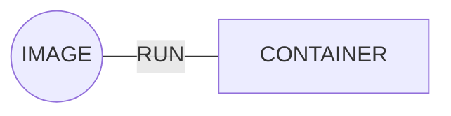
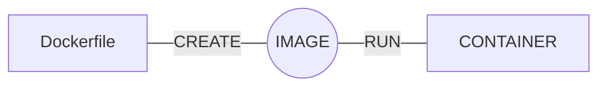
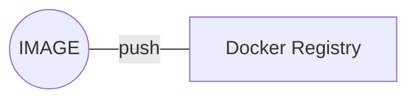
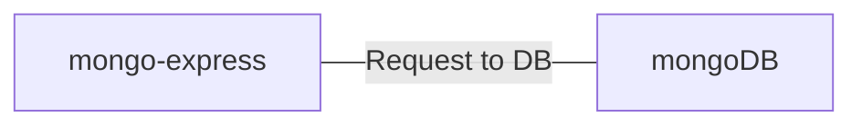
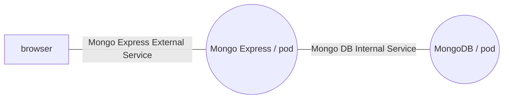

<h1 align="center">Docker</h1>

<h2>What is Docker ?</h2>

- Docker is a tool for running applications in an isolated environment.
- Similar to Virtual Machine.
- App run in same environment.
- Standard for software deployment.

<h3>Container vs VM</h3>

- **Container** are an *abstraction* at the app layer that packages *code* and *dependecies* together. Multiple containers can run on the same machine and share the OS Kernel with other containers, each running as isolated processes in user space.

- **Virtual Machines** are an abstraction of physical hardware turning one *server* into *many servers*. The hypervisor allows multiple VMs to run on a single machine. Each VM includes a full copy of an operating system, the application, necessary binaries and libraries - taking up tens of GBs. VMs can also be slow to boot.

<h2>Images and Containers</h2>

<h3>Docker image</h3>

- Image is a template for creating an environment of your Choice.
- Snapshot.
- Has everything need to run your apps.
- OS, Software, App Code.

<h3>Container</h3>

- Running instance of an Image.



<h2>Pulling NGINX image</h2>

> https://hub.docker.com/_/nginx

```bash
$ docker pull nginx
```

<h3>Running container</h3>

```bash
$ docker run nginx:latest
```
*Or*
```bash
$ docker run -d nginx:latest
```
> --detach, -d Run container in background and print container ID

<h3>List containers</h3>

```bash
$ docker container ls
```
*Or*
```bash
$ docker ps
```

<h3>Stop container</h3>

```bash
$ docker stop my_container
```

<h2>Exposing port</h2>

- When a container is created using docker create or docker run, by default it does not publish any of its ports to the outside world.
- In order to make a port available to services outside of Docker, or to Docker containers which are not connected to the container’s network, we can use the -P or -p flag. This creates a firewall rule which maps a container port to a port on the Docker host to the outside world.

<h3>Publish or expose port</h3>

```bash
$ docker run -d -p 8080:80 nginx:latest
```

<h2>Exposing multiple ports</h2>

- You can expose multiple port which maps a container port to the outside world.

```bash
$ docker run -d -p 3000:80 -p 8080:80 nginx:latest
```

<h2>Managing containers</h2>

**Stop one or more running containers**
> https://docs.docker.com/engine/reference/commandline/stop/

```bash
$ docker stop [OPTIONS] CONTAINER [CONTAINER...]
```

<h3>Observation</h3>

*You just stop the container do not exclude it.*

**Start one or more stopped containers**
> https://docs.docker.com/engine/reference/commandline/start/

```bash
$ docker start [OPTIONS] CONTAINER [CONTAINER...]
```

**List containers**
> https://docs.docker.com/engine/reference/commandline/ps/

```bash
$ docker ps [OPTIONS]
```

**Remove one or more containers**
> https://docs.docker.com/engine/reference/commandline/rm/

```bash
$ docker rm [OPTIONS] CONTAINER [CONTAINER...]
```

<h3>Tip</h3>

*To remove multiple container is necessary use this command:*

```bash
$ docker rm $(docker ps -aq)
```

<h2>Naming containers</h2>

- When Docker containers are created, the system automatically assign a universally unique identifier (UUID) number to each container to avoid any naming conflicts and improve automation without human involvement.
- You can assign memorable names to your docker containers when you run them, using the --name flag as follows. The -d flag tells docker to run a container in detached mode, in the background and print the new container ID.

```bash
$ docker run --name [CONTAINER NAME] -d -p 3000:80 -p 8080:80 nginx:latest
```

<h2>DOCKER PS --FORMAT</h2>

**This command show how to format the list containers.**
> https://docs.docker.com/config/formatting/

```bash
$ docker ps --format='{{ .ID }}\t{{.Image}}\t{{ .Names }}'
```

<h2>Volumes</h2>

> https://docs.docker.com/storage/volumes/

- Allow sharing of data. File & Folders.
- Allow sharing of data between **host** and **container**, also between **containers**.

```bash
$ docker run --name some-nginx -v [SOURCE]:[DESTINATION]:ro -d nginx
$ # Example
$ docker run --name some-nginx -v /some/content:/usr/share/nginx/html:ro -d nginx
```

<h2>Volumes between host and container</h2>

```bash
$ docker run --name website -v $(pwd):/usr/share/nginx/html:ro -d -p 8080:80 nginx:latest
```

- If you want to see the file or folder into the container, you can use this command:
> https://docs.docker.com/engine/reference/commandline/exec/

```bash
$ docker exec -it [CONTAINER NAME] bash
```

<h2>Customize website</h2>

> https://startbootstrap.com/

<h2>Volumes between containers</h2>

```bash
$ docker run --name website-copy --volumes-from website -d -p 8081:80 nginx:latest
```
> --volumes-from Mount volumes from the specified container(s)

<h2>Dockerfile</h2>

- Build own images.
- Docker can build images automatically by reading the instructions from a Dockerfile.
> https://docs.docker.com/engine/reference/builder/



<h2>Creating Dockerfile</h2>

> FROM: the FROM instruction specifies the *Parent Image* from which you are building.

> ADD: Copy files, folders, or remote URLs from source to the dest path in the image's filesystem.

```Dockerfile
FROM nginx:latest
ADD . /usr/share/nginx/html
```

<h2>Docker build</h2>

> https://docs.docker.com/engine/reference/commandline/build/

```bash
$ docker build --tag website:latest .
```
> --tag , -t Name and optionally a tag in the name:tag format

> . This will look for a Dockerfile

<h2>Dockerfile to api</h2>

- If you have guess about which image is necessary for your api, search in docker hub.

*Example:*
> https://hub.docker.com/_/node

```Dockerfile
FROM node:latest
WORKDIR /app
ADD . .
RUN npm install
CMD node index.js
```

> WORKDIR: Set the working directory for any subsequent ADD, COPY, CMD, ENTRYPOINT, or RUN instructions that follow it in the Dockerfile.

> RUN: The RUN instruction will execute any commands in a new layer on top of the current image and commit the results.

> CMD: Provide defaults for an executing container. If an executable is not specified, then ENTRYPOINT must be specified as well. There can only be one CMD instruction in a Dockerfile.

<h2>Running containers for our API</h2>

<h3>Step to Step</h3>

**Run this command to create the imagem of API.**
```bash
$ docker build --tag my-api:latest
```

**Run this command to create the container from image API.**
```bash
$ docker run --name my-container -d -p 3000:3000 my-api:latest
```

<h2>.dockerignore file</h2>

> https://docs.docker.com/engine/reference/builder/

- Before the docker CLI sends the context to the docker daemon, it looks for a file named .dockerignore in the root directory of the context. If this file exists, the CLI modifies the context to exclude files and directories that match patterns in it. This helps to avoid unnecessarily sending large or sensitive files and directories to the daemon and potentially adding them to images using ADD or COPY.

<h2>Caching and Layers</h2>

> https://docs.docker.com/build/cache/

- Cache help us to improve the process of build image every time that the code changes. Especially when the source code change but the dependecies do not chage, it will use the cache to improve the process.
- When you will build your Dockerfile, it is necessary to think about what change every time in your code and do not change every time.

<h2>Alpine</h2>

> https://www.alpinelinux.org/

- It is the way to improve/reduce the memory size of image.

<h2>Pulling Alpine Images</h2>

**Before:**
```bash
REPOSITORY         TAG          IMAGE ID       CREATED        SIZE
nginx              latest       6efc10a0510f   13 days ago    142MB
nginx              alpine       8e75cbc5b25c   3 weeks ago    41MB
```

```bash
$ docker pull nginx:alpine
```

- After you use the version alpine from nginx, the memory size of image decrease.

**After:**
```bash
REPOSITORY         TAG          IMAGE ID       CREATED        SIZE
nginx              alpine       8e75cbc5b25c   3 weeks ago    41MB
```

<h2>Using Alpine</h3>

- This is an example how to use alpine version with node to improve the memory size of image.

```Dockerfile
FROM node:alpine
WORKDIR /app
ADD package*.json ./
RUN npm install
ADD . .
CMD node index.js
```
<h2>Tags and Versions</h2>

- Allow you to control image version.
- You have full control of what image you pull and what image application depends on.
- Avoids breaking changes.

*Example:*

docker pull node:alpine

**Node 8**


docker pull node:alpine

**Node 12**


YOU HAVE CONTROL

- The better way to solve this problem, it is say to your dockerfile execute a version of node:8-alpine or node:12-alpine.

<h2>Tagging Override</h3>

- When you make a change in your image and use the same tag and image, you will override the exist one, remove the repository and tag.

<h2>Tagging Own Images</h3>

```bash
$ docker tag user-api-service-image:latest user-api-service-image:1
```

<h2>Docker Registries</h2>

- Highly scalable serve side application that stores and lets you distribute Docker images.
- Used in your CD/CI Pipeline.
- Run your applications.



<h3>Private/Public</h3>

**Docker Hub**

**quay.io**

**Amazon ECR**

<h2>Create Docker Hub Repo</h2>

> https://hub.docker.com/


<h2>Pushing Images to Docker Hub</h3>

```bash
$ docker tag local-image:tagname new-repo:tagname
$ docker push new-repo:tagname
```

**If you want to do login via terminal, you can use the follow command:**

```bash
$ docker login
```

<h2>Docker Inspect</h2>

```bash
$ docker inspect [ID or NAME]
```

<h2>Docker Logs</h2>

> https://docs.docker.com/engine/reference/commandline/logs/

**This command will help you see the logs from container.**

```bash
$ docker logs [OPTIONS] CONTAINER
$ docker logs -f [OPTIONS] CONTAINER
```
> --follow , -f		Follow log output

<h2>Docker Exec</h2>

> https://docs.docker.com/engine/reference/commandline/exec/

**This commando will help you get into to the container.**

```bash
$ docker exec [OPTIONS] CONTAINER COMMAND [ARG...]
```

<h1 align="center">Kubernetes</h1>

<h2>What is Kubernetes ?</h2>

- Open source container orchestration tool.
- Developed by Google.
- Helps you manage containerized applications in different deployment environments.

<h2>What features do orchestration tools offer ?</h2>

- High Availability or no downtime.
- Sacalability or high performance.
- Disaster recovery - backup and restore.

<h2>Kubernetes Architecture</h2>

- The **kubernetes cluster** is made up with one master node and connect to it with a couple of worker nodes, where each node has kubelet process running on it. 
- **Kubelet** is actually a kubernetes process that makes possible for the cluster talk to each other, comunicate each other and execute some tasks and those nodes.
- Each **worker node** has docker containers of different applications deploy on it. 
- On **Worker Nodes** your application are running.
- On **Master Nodes** important K8s process are running.

<h3>Process running into the Master Nodes</h3>

- **API Server** is the entrypoint to K8s cluster. This is the process which different kubernetes client will talk to you, like UI, API if you use some scripts and CLI.
- **Controller manager** keeps track of whats happening in the cluster.
- **Scheduler** is responsible for scheduling containers on diffrent nodes.
- **etcd** holds anytime the current state of the kubernetes cluster. So, it has own the configuration data inside and other states data of node and container inside it. The backup restore is actually make from etcd snapshot, because you can recover the whole cluster data using etcd snapshot.

**Important**

<p>Virtual Network is very important component of kubernetes, which enable those nodes (Worker nodes and Master nodes) talk to each other thorught the Virtual Network.</P>

<h2>Pod, Service & Ingress</h2>

<h3>Node and Pod</h3>

> https://kubernetes.io/docs/concepts/workloads/pods/

**Worker node in Kubernetes is node, which is a simple server, physical or virtual machine.**

- It is smallest unit of K8s.
- Abstratction over container. 
- The pod create the environment and run the contairnes. 
- Usually 1 application per Pod.
- Each Pod gets its own IP address and it can communicate with other Pod using own IP address (Service).
- When a Pod die another Pod is create to replace the old Pod and a new IP address is create.
- Each Pod is meant to run a single instance of a given application.

<h3>Service</h3>

> https://kubernetes.io/docs/concepts/services-networking/service/

- Service is static IP adress or pernament IP address.
- It can be attach to each Pod.
- Applications and Database will have its own Service.
- Lifecycle of Pod and Service NOT connected.
- Load balancer.

<h3>External Service</h3>

<p>External Service help you to open communication from externa resource</p>

<h3>Internal Service</h3>

<p>When you want to create externar service, however you do not want to create externa service to your database. So, you can create an Internal Service.</p>

<h3>Ingress</h3>

> https://kubernetes.io/docs/concepts/services-networking/ingress/

- An API object that manages external access to the services in a cluster, typically HTTP.
- The request goes first to ingress and after to into the services.

<h2>Config Map and Secret</h2>

- ConfigMap is an external configuration of your application. Usually, Config Map will have configurations about external URL.
- Pod get the configuration that ConfigMap have in it.

**IMPORTANT: Don't put credentials into ConfigMap**

- Secret is used to store secret data, for example: DB_USER and DB_PASSWORD.
- base64 encoded.
- You can connect the secret with your pod and use the secret data.

**IMPORTANT: Use it as environment variables or as a properties file**

<h2>Volumes</h2>

> https://kubernetes.io/docs/concepts/storage/volumes/

- The way that you can resolve problems relation with storage data is using volumes. It can physical (storage on local machine) or cloud (outside of the K8s cluster), when your application crash or other thing happen to it, usually, you will lost your data if you do not have a volume to storage them. So, volume resolve this problem, it share the data with volume.
- Storage is external component, it is plugin in your k8s Cluster.

**IMPORTANT: K8s doesn't manage data persistance!**

<h2>Deployment and Stateful Sets</h2>

> https://kubernetes.io/docs/concepts/workloads/controllers/statefulset/
> https://kubernetes.io/docs/concepts/workloads/controllers/deployment/

- If your application crash (Pod dies) and the user can't be reached, another node will create and replicated everthing. Also, this container will use the same service that one. Because, service has two functionalities that is: permanent IP and Load Balancer.
- Load balancer get the request and transfer to another cluster.
- Define blueprints for pods, this will contain the quantity from pod's replicas.

**IMPORTANT: DB can't be replicated via Deployment**

<p>The reason for that, it is that Database has a state that its data. If you have replicas from your application, you must access or share the same Database.</p>

- *Deployment* for **stateLESS** apps.
- *StatefulSet* for **stateFUL** Apps or Databases.
- DB are often hosted outside of K8s cluster.

<h2>Components Summary</h2>

<h3>Main Kubernetes Components summarized</h3>

- Pod is abstraction of containers.
- Service is used to communicate with external and internal resources, for example: Database and Application.
- Ingres is used to route traffic into cluster.
- ConfigMap and Secrets are used to external configuration.
- Volumes are used for data persistences.
- Pod Blueprints that replicated the mechanism like deployment and StatefulSet.

<h2>Minikube and Kubectl</h2>

<h3>What is minikube ?</h3>

- Minikube is one Node Cluster, where the Master processes and Worker processes both run on one node. This node will have a docker container runtime pre-installed. So, you will be able  to run the containers.
- Minikube will create a Virtual Box on your laptop.
- Node runs in that Virtual Box.
- Minikube is 1 Node K8s cluster that runs in a Virtual Box.
- It is used for testing purposes.

<h3>What is kubectl ?</h3>

- Kubectl is command line tool for K8s cluster.
- Master processes call Api Server, it is actually the main entrepoint into Kubernetes Cluster. It enables interaction with cluster. The way you can talk to Api Server is through different clients, for example: UI, API and CLI (Kubectl).
- Kubectl is the most powerful of 3 clients. You can do anything with Kubectl into the Kubernetes Cluster.
- The Worker processes on the minikube, allow you create components, delete components and etc. The Worker processes enable pods to run on node.
- Kubectl is the tool that you used to interact with Minikube cluster and Cloud cluster.

<h3>Kubectl CLI</h3>

<p>Kubectl CLI is for configuring the Minikube cluster.</P>

<h3>Minikube CLI</h3>

<p>Minikube CLI is for start up/deleting the cluster.</p>

<h2>Basic kubectl commands</h2>

**This command is used to get status of nodes.** 
```bash
$ kubectl get nodes
```

**This command is used to check the pods.**
```bash
$ kubectl get pod
```

**This command is used to check the services.**
```bash
$ kubectl get services
```

**This command is used to create the components**
```bash
$ kubectl create
$ # Example
$ kubectl create deployment NAME --image=image [--dry-run] [options]
$ kubectl create deployment nginx-depl --image=nginx
```
**REMEMBER: Deployment is abstraction layer from the pod.**

**This command is used to check the deployment components.**
```bash
$ kubectl get deployment
```

**This command is used to check the logs from the pods.**
```bash
$ kubectl logs [pod name]
```

**This command is used to show the chagens about the container into the pod.**
```bash
$ kubectl describe pod [pod name]
```

**This command is used to check when something it is not working into the container.**
```bash
$ kubectl exec -it [pod name] -- bin/bash
```

**This command is used to get status of minikube.**
```bash
$ minikube status
```

**This command is used to configurate the components, usually, it look for a file.**
```bash
$ kubectl apply -f [file name]
```
**IMPORTANT: K8s knows when to create or update deployment.**

<h2>Kubectl Commands Summary</h2>

<h3>Summarize kubectl commands</h3>

**Create deployment**
```bash
# Create deployment
$ kubectl create deployment [name]
```

**Status of different K8s components**
```bash
$ kubectl get nodes | pod | services | replicaset | deployment
```

**Debugging pods**
```bash
# Log to console
$ kubectl logs [pod name]
# Get Interactive Terminal
$ kubectl exec -it [pod name] -- bin/bash
# Get info about pod
$ kubectl describe pod [pod name]
```

**Use configuration file for CRUD**
```bash
# Apply a configuration file
$ kubectl apply -f [file name]
# Delete with configuration file
$ kubectl delete -f [file name]
```

<h2>Deploying MongoDB and Mongo Express</h2>

<h3>Complete Application Setup with Kubernetes Components</h3>



- We will need the follow components to setup this application:
  - **2 Deployment / Pod:** Mongo Express and Mongo DB
  - **2 Services:** Internal Service to communicate with MongoDB and External Service to communicate with Mongo Express
  - **1 ConfigMap:** DB Url that will use for environment variables
  - **1 Secret:** DB User DB Pwd that will use for environment variables



<h3>Mongo DB Deployment</h3>

```yaml
apiVersion: apps/v1
kind: Deployment
metadata:
  name: mongodb-deployment
  labels:
    app: mongodb
spec:
  replicas: 1
  selector:
    matchLabels:
      app: mongodb
  template:
    metadata:
      labels:
        app: mongodb
    spec:
      containers:
      - name: mongodb
        image: mongo
        ports:
        - containerPort: 27017
        env:
        - name: MONGO_INITDB_ROOT_USERNAME
          value: 
        - name: MONGO_INITDB_ROOT_PASSWORD
          value: 
```
**IMPORTANT: Username and Password should not go here!**

*Secret lives in K8s, not in the repository!*

<h3>Secret</h3>

<p>Secret must be created before the Deployment.</p>

**Secret Configuration file**

- *kind:* Secret
- *metadata/name:* a random name
- *type:* "Opaque" - default for arbitrary key-value pairs
- *data:* the actual contents in key-value pairs

```yaml
apiVersion: v1
kind: Secret
metadata:
  name: mongodb-secret
type: Opaque
data:
  mongo-root-username:
  mongo-root-password:
```

- When you create a secret the values must be base64 encoded. To this, you can go in your terminal and use the follow command:
```bash
$ echo -n 'username' | base64
dXNlcm5hbWU=
$ echo -n 'password' | base64
cGFzc3dvcmQ=
```

**How to reference secret into the deployment file ?**

```yaml
- name: MONGO_INITDB_ROOT_USERNAME
  valueFrom:
    secretKeyRef:
      name: mongodb-secret
      key: mongo-root-username
```

<h3>Mongo DB Internal Service</h3>

<p>It is possible multiple documents in 1 file. You just need add the follow signal:</p>

```yaml
---
```

- Deployment & Service can put into in 1 file, because they belong together.

**Service Configuration File**

```yaml
apiVersion: v1
kind: Service
metadata:
  name: mongodb-service
spec:
  selector:
    app: mongodb
  ports:
    - protocol: TCP
      port: 27017
      targetPort: 27017
```

- *kind:* Service
- *metadata/name:* A random name
- *selector:* To connect to Pod through label, this way the service can find the Pod and connect it.
- *ports/port:* Service port
- *ports/targetPort:* ContainerPort of Deployment

- Endpoints are the IP address of Pod.
```bash
Endpoints:         10.244.0.15:27017
```

- With this command you can see the IP address the pod.
```bash
jneneve@LA-PE09MA77:~/Documents/docker-and-kubernetes/k8s-configuration$ kubectl get pod -o wide
NAME                                  READY   STATUS    RESTARTS   AGE   IP            NODE       NOMINATED NODE   READINESS GATES
mongodb-deployment-5d966bd9d6-mlwqv   1/1     Running   0          17m   10.244.0.15   minikube   <none>           <none>
```

<h3>Deployment Service and Config Map</h3>

**ConfigMap**

- External configuration
- Centralized
- Other components can use it

**ConfigMap Configuration File**

- *kind:* ConfigMap
- *metadata/name*: A random name
- *data:* The actual contents in key-value pairs

- ConfigMap must *already* be in the K8s cluster, where referencing it.
- The way that you can reference the ConfigMap into the Deployment is the same way when you reference the secret.

<h3>Mongo Express External Service</h3>

**How to make it an External Service ?**

- *type:* Loadbalancer
  - Assigns service an external IP address and so accepts external requests.
  - Internal service also acts as a loadbalancer.
- *nodePort:* 
  - Port for external IP address.
  - Port you need to put into browser
  - Must be between 30000-32767

*Internal Service or Cluster IP is DEFAULT*

*LoadBalancer assigns in addition an External-IP!*
```bash
jneneve@LA-PE09MA77:~/Documents/docker-and-kubernetes/k8s-configuration$ minikube service mongo-express-service
|-----------|-----------------------|-------------|---------------------------|
| NAMESPACE |         NAME          | TARGET PORT |            URL            |
|-----------|-----------------------|-------------|---------------------------|
| default   | mongo-express-service |        8081 | http://192.168.49.2:30000 |
|-----------|-----------------------|-------------|---------------------------|
🏃  Starting tunnel for service mongo-express-service.
|-----------|-----------------------|-------------|------------------------|
| NAMESPACE |         NAME          | TARGET PORT |          URL           |
|-----------|-----------------------|-------------|------------------------|
| default   | mongo-express-service |             | http://127.0.0.1:42611 |
|-----------|-----------------------|-------------|------------------------|
🎉  Opening service default/mongo-express-service in default browser...
👉  http://127.0.0.1:42611
❗  Because you are using a Docker driver on linux, the terminal needs to be open to run it.
```
